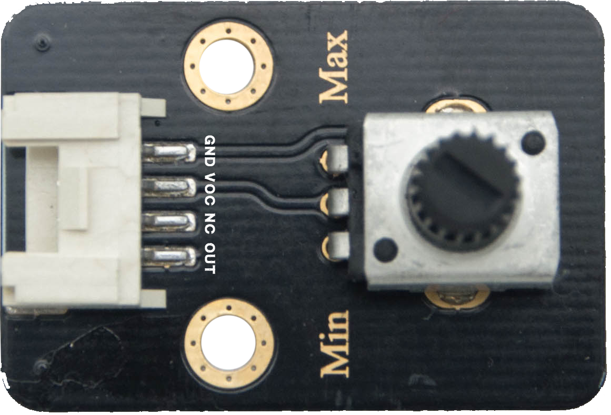

电位器
======================================================
 

   
应用编程接口说明
++++++++++++++++++++++++++++++++++++++++++++++++++++++

::

    '''
     导入 potentiometer 模块 
    '''
    from openaie import potentiometer
	
    '''
     类：电位器
     参数:
        port: 端口号 -- 3，4 
    '''
    class potentiometer(port)
    
    '''
     方法：读取测量值
     返回值：0~100
    '''
    potentiometer.read()

案例
++++++++++++++++++++++++++++++++++++++++++++++++++++++
    
**1. 数值读取**
:: 
    import time 
    from openaie import potentiometer
    
    p = potentiometer(3) # 电位器连接 端口3
    while True:
        print("val: ", p.read()) 
        time.sleep_ms(100)  
		
------------------------------------------------------
        