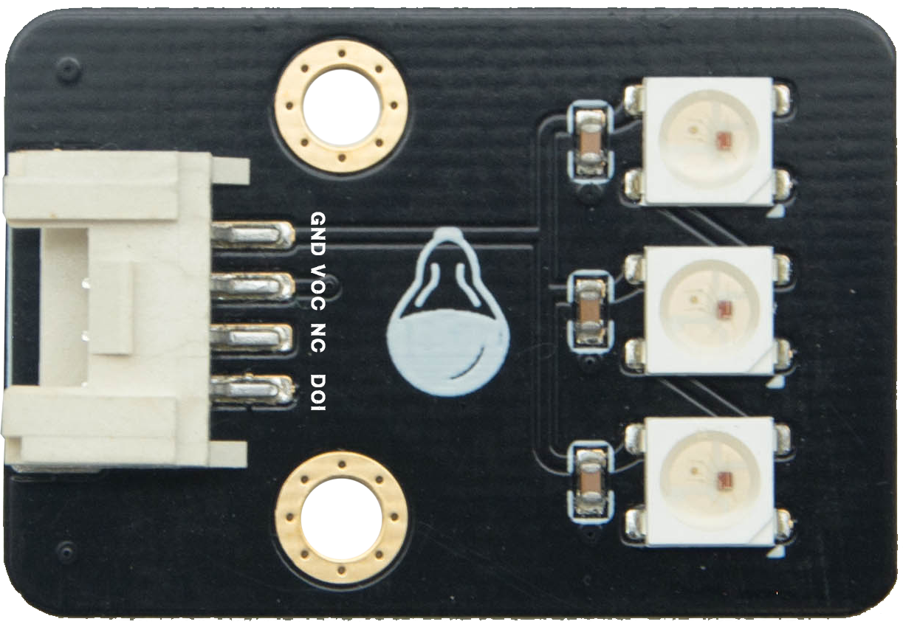

可编程全彩LED
======================================================

板载三颗RGB全彩LED，每种颜色可实现0~255共256级亮度调节，通过对红(Red)、绿(Green)、蓝(Blue)三个颜色通道的调节可叠加发出多种颜色的光。

应用编程接口说明
++++++++++++++++++++++++++++++++++++++++++++++++++++++

::

    '''
     导入 rgb_led 模块 
    '''
    from openaie import rgb_led

    '''
     类: 可编程全彩LED  
     参数:
        port: 端口号 -- 1~8 
        num: 灯珠数量，默认为 3
    '''
    rgb_led(port, num=3)
    
    ''' 
     方法：设置灯颜色值
     参数：
        id：板载灯编号 -- 0, 1, 2
        (r, g, b)：颜色亮度值 -- 0~255 
    '''
    rgb_led.set(id, (r, g, b)) 
    
    '''
     方法：将设置值输出显示
    '''
    rgb_led.display()  

.. Note:: 每种颜色的LED共有2^8=256(0~255)个发光等级，即共有2^8^3=16 777 216种颜色组合。通过查找 \ `RGB颜色对照表 <https://tool.oschina.net/commons?type=3>`_ 生成自己喜欢的颜色。

案例
++++++++++++++++++++++++++++++++++++++++++++++++++++++

**1. 点亮LED**
::

    import time
    from openaie import rgb_led     # 导入模块

    rgb = rgb_led(1)            # 端口1
    rgb.set(0, (50, 0, 0))      # 将第1个灯设置为红色亮度值为：50
    rgb.set(1, (0, 60, 0))      # 将第2个灯设置为绿色亮度值为：60
    rgb.set(2, (0, 0, 70))      # 将第3个灯设置为蓝色亮度值为：70
    rgb.display()               # 输出显示
    time.sleep_ms(1000)

    color = ((50,0,0), (0,50,0), (0,0,50), (0,0,0))
    for i in range(4):
        rgb.set(0, color[i])
        rgb.set(1, color[i])
        rgb.set(2, color[i])
        rgb.display()
        time.sleep_ms(500)

**2. 呼吸灯**
::

    import time 
    from openaie import rgb_led

    rgb = rgb_led(1)     
    dir = True
    while True:
        for i in range(100):
            if dir :
                rgb.set(0, (0,i,0))
            else :
                rgb.set(0, (0,100-i,0))
            rgb.display()
            time.sleep_ms(20)
        dir = not dir

        
**3. 颜色渐变**

RGB彩虹色渐变算法: https://www.cnblogs.com/wzdxy/p/5346930.html
::

    import time
    from openaie import rgb_led 

    rgb = rgb_led(1)
    
    def wheel(pos):
        # 通过改变在0和255之间的每个颜色参数产生彩虹色光谱
        # Input a value 0 to 255 to get a color value.
        # The colours are a transition r - g - b - back to r.
        if pos < 0 or pos > 255:
            r = g = b = 0
        elif pos < 85:
            r = int(pos * 3)
            g = int(255 - pos*3)
            b = 0
        elif pos < 170:
            pos -= 85
            r = int(255 - pos*3)
            g = 0
            b = int(pos*3)
        else:
            pos -= 170
            r = 0
            g = int(pos*3)
            b = int(255 - pos*3)
        return (r, g, b)

    def rainbow_cycle(wait_ms):
        # 彩虹效果
        n=3
        for j in range(255):
            for i in range(n):
                pixel_index = (i * 256 // n) + j
                rgb.set(i, wheel(pixel_index & 255)) 
            rgb.display()
            time.sleep_ms(wait_ms)
     
    while True:
        rainbow_cycle(10)      

------------------------------------------------------

