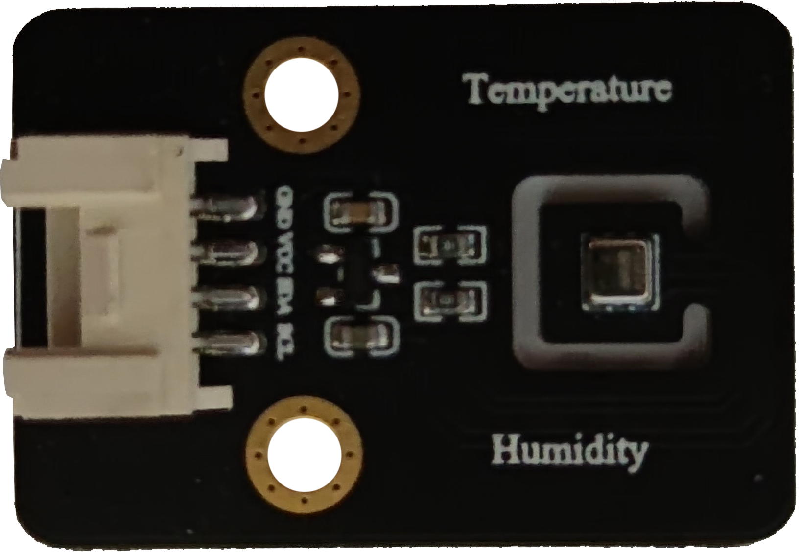

温湿度传感器
======================================================
温度测量范围：-40~85℃；误差：±0.3%

湿度测量范围：0~100%；误差：±2%

应用编程接口说明
++++++++++++++++++++++++++++++++++++++++++++++++++++++

::

    '''
     导入 th_sensor 模块 
    '''
    from openaie import th_sensor

    '''
     类：温湿度传感器 
     参数:
        port: 端口号 -- 1~8 
    '''
    class th_sensor(port)
    
    '''
     方法：读取温度
     返回值：温度 
    '''
    th_sensor.read_temperature()
    
    '''
     方法：读取湿度
     返回值：湿度 
    '''
    th_sensor.read_humidity()

案例
++++++++++++++++++++++++++++++++++++++++++++++++++++++

        
**1. 温湿度读取显示**
::

    import time
    import lcd 
    from openaie import th_sensor

    th = th_sensor(5)
    lcd.rotation(1)
    lcd.clear(0)

    while True:
        info = "temperature: %.1fC  humidity: %d%%"%(th.read_temperature(), th.read_humidity())
        print(info)
        lcd.draw_string(10, 16, info, 0x0000FF, 0)
        time.sleep_ms(1000)
		
------------------------------------------------------
    
    